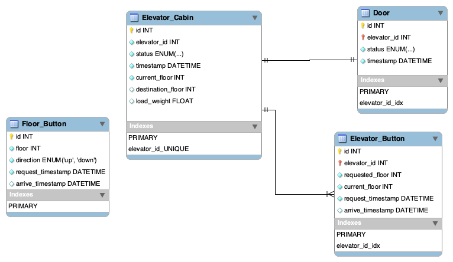

# Elevator Data modeling challenge

We have a system to simulate different elevator control mechanisms in their buildings. Let us assume a building has **M** elevators and **N** floors.

You are in charge of measuring the performance of different elevator control mechanisms and so will need to design the data model to capture observed data and the measurements you would calculate on that data model. Assume a typical simulation run proceeds over a 24-hour period and you are allowed to observe as much as you like (when/where each elevator is, how many passengers, where the passengers are, when/where they arrive/depart, etc. – if in doubt assume you can observe it).

## Elevator typical scenario

- Passenger pressed floor button 🔼 🔽
- Elevator system detects floor button pressed ℹ️
- Elevator moves to the floor 🛗
- Elevator doors open ⏪ ⏩
- Passenger gets in and presses elevator button ⏸
- Elevator doors closes ⏩ ⏪
- Elevator moves to required floor 🛗
- Elevator doors open  ⏪ ⏩
- Passenger gets out ⏸ ⏹
- Elevator doors closes  ⏩ ⏪

## Data model

### ERD

Following is a ERD representation of the Elevator monitored system:



- 🔑 Represent Primary key (yellow key)
- 🗝 Represent Foreign key (red key)
- ◆ White diamond symbol represent column which allow **Null** (due to event not completed yet)
  - in case elevator is empty the `load_weight` can be **Null**
  - in case elevator is Idle `destination_floor` will be **Null**
  - in case elevator is moving and haven't reach destination floor `arrive_timestamp` will be **Null**
- `direction` column in `Floor_Button` table, is ENUM with the following options **(Up/Down)**
- `status` column in `Elevator_cabin` table, is ENUM with the following options **(Idle/Moving)**
- `status` column in `Door` table, is ENUM with the following options **(Open/Close/Maintenance)**

### Relationships

- **one-to-one**: between elevator and elevator_door (assuming each elevator has only one door)
- **one-to-many**: between elevator and elevator_button (assuming each elevator has multiple buttons, one button for each floor)

### Main component in elevator system

Those would be the main component in elevator system, which we can have them in separate entities:

- **Elevator cabin**: Keep track the **events** of the elevator cabin using multiple sensors we will be able to track the varies events
- **Elevator doors**: Keep track of the elevator doors (open/close/failure)
- **Elevator button**: Keep track of the requested floor level
- **Floor button**: Keep track of the requested movement direction
- Elevator Main Control System (Dispatcher)

## Questions

### 1) List other performance measures that would be useful or important to measure

So as already mentioned one of performance measures metrics, would be:

- Average waiting time per passenger
- Average journey time per passenger

In addition to those two metrics, I would think about measuring:

- Determine elevators which have the highest number of activities
- Determine the most frequently requested floor number by passengers
- Elevator round trip time
- Average Number of passengers it can be studied on hourly based over the whole day (since this metric can have a direct impact on average waiting time and average journey time)

- In addition to these metrics, Looking at average waiting time is very general metric, we can break it down to few types of waiting time like:
  - waiting due to request from other floors.
  - waiting due to elevator travelling speed.
  - waiting due to elevator response time.

- In another perspective would be considering **cost** point of view like number of times the elevator needs **maintenance**, let's say if elevator performs 10000 actions or 3 months, whichever earlier would requires a maintenance.
So one thing would be to consider is how to reduce the number of action by checking how many inefficient actions the elevator took, based on that we might setup preferred Idle station to make sure the elevator is closer to requester, which also can help to reduce waiting time.

### 2) What would a suitable data representation look like

There isn't a one-size fits all approach and there isn't a singular solution. with that been said, we can easily alter our model depending on which adequate any point of interest we would like to focus on.

One Suitable data representation would be to store the data in database model using de-normalized tables, which allow us to retrieve the data faster and more efficiently with less joins.

One down side for this is the de-normalization is we will have more redundant data which make requires extra storage space due to the model size is bigger.
Another is Potential data anomalies
When de-normalizing a database, we need to take care of every single case of duplicate data.

### 3) For “Average waiting time per passenger” and at least 2 other performance measures, describe how they can be easily calculated from your data model. Preferably write the SQL code you would use to calculate the waiting and journey times

- **Average waiting time per passenger**

  average waiting time, is the average time from the moment the `floor_button` click register till one of the elevators respond and transits to requester floor.

  do to our data model, it's straightforward since we keep track of the request time, and we also record the time of the respond time when the elevator arrive to requester

  ```sql
  SELECT AVG(arrive_timestamp - request_timestamp) AS avg_waiting_time
    FROM Floor_button
  ```

- **Average journey time per passenger**
  average journey time, is the average time from the moment the `elevator_button` click register till the elevator reach the requested level and mark this event as completed.

  ```sql
  SELECT AVG(arrive_timestamp - request_timestamp) AS avg_journey_time
    FROM Elevator_Button
  ```

- **Determine elevators which have the highest number of activities**

  ```sql
  SELECT elevator_id, count(id) AS events_count
    FROM Elevator_Cabin
   GROUP BY elevator_id
   ORDER BY events_count DESC
  ```

- **Determine the most frequently requested floor number by passengers**

  ```sql
  SELECT requested_floor, count(id) as events_count
    FROM Elevator_button
   GROUP BY requested_floor
   ORDER BY events_count DESC
  ```
